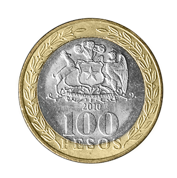

```{r setup, include=FALSE}
options(htmltools.dir.version = FALSE)
knitr::opts_chunk$set(
   fig.retina=3,
  out.width = "70%",
  cache = FALSE,
  echo = T,
  message = FALSE, 
  warning = FALSE,
  hiline = TRUE
)
options(scipen = 999)
```

```{r xaringan-themer, include=FALSE, warning=FALSE}
library(xaringanthemer)
#style_duo_accent(
#  primary_color = "#1381B0",
#  secondary_color = "#FF961C",
#  inverse_header_color = "#FFFFFF"
#)
xaringanExtra::use_panelset()

```


## Contenidos de la clase

- Control de flujos

- Práctica 1

- *Loops* (for y while)

- Práctica 2

---

## ¿Por qué necesito programar?

- Recolección de datos

- Edición de datos

- Análisis de datos

- Comunicación de datos

--

#### Es una habilidad fundamental para el trabajo como analista

--

#### La programación es una herramienta de aprendizaje

--

#### Nos pone en contacto con una comunidad enorme


---

## Existen muchos lenguajes de programación


R

Python

JavaScript

C C++ C#

Java

Scala

Rust

--

Y un largo etcétera

--

### Nosotros trabajaremos con R (90%) y Python (10%)

---

## Punto de partida

Asumiré que todos y todas:

- Están familiarizados con `R` y RStudio

--

- Manejan los principales paquetes dentro de `tidyverse`

--

- Tienen algo de experiencia con `dplyr` (mutate, filter, group_by, summarise, if_else, select, joins, pivots) 

--

### Si necesitan reforzar estos contenidos, acérquense o escríbanme un correo 

--

### Puedo facilitar material extra 

---
class: inverse center middle

# Controles de flujo

---

## if

```{r}
mascota <- "gato"

if (mascota == "perro") {
  print("Mi mascota es un perro")
}

if (mascota == "gato") {
  print("Mi mascota es un gato")
}

```


Si se cumple la condición, se ejecuta el código que está dentro del bloque

---

## if

#### ¿Qué imprime este código?

```{r, eval=FALSE}

mascota <- "canguro"

if (mascota == "canguro") {
  print("Mi mascota es un canguro")
}

if (mascota == "canguro") {
  print("Mi mascota es un canguro")
}

```

--

```{r, echo=FALSE}

mascota <- "canguro"

if (mascota == "canguro") {
  print("Mi mascota es un canguro")
}

if (mascota == "canguro") {
  print("Mi mascota es un canguro")
}

```


---

## if

#### ¿Qué imprime este código?

```{r, eval=FALSE}

mascota <- "canguro"

if (mascota == "canguro") {
  print("Mi mascota es un canguro")
}

mascota <- "pulga"

if (mascota == "pulga") {
  print("Mi mascota es una pulga")
}

```

--

```{r, echo=FALSE}

mascota <- "canguro"

if (mascota == "canguro") {
  print("Mi mascota es un canguro")
}

mascota <- "pulga"

if (mascota == "pulga") {
  print("Mi mascota es una pulga")
}

```


---

## if..else..  

Sí se cumple la condición, ejecuta **A**. En otro caso, ejecuta **B** 
 
```{r}
mascota <- "gato"

if (mascota == "perro") {
  print("Mi mascota es un perro")
} else {
  print("Mi mascota NO es un perro")
}


```

--
 
```{r}
mascota <- "perro"

if (mascota == "perro") {
  print("Mi mascota es un perro")
} else {
  print("Mi mascota NO es un perro")
}


```

#### En el segundo caso evaluamos 2 sentencias

---

## Volvamos a analizar este código


```{r}
mascota <- "perro"

if (mascota == "perro") {
  print("Mi mascota es un perro")
} else {
  print("Mi mascota NO es un perro")
}

```

--

```{r, eval=FALSE}
if (mascota == "perro") {
  print("Mi mascota es un perro")
}

if (mascota != "perro") {
  print("Mi mascota NO es un perro")
}
```


 
---

## Último ejemplo con if..else..

.pull-left[

#### Vamos a simular el lanzamiento de una moneda

]

.pull-right[

]


```{r, echo=FALSE}
set.seed(1234)
```

Variable aleatoria entre 0 y 1 

```{r}
lanzamiento <- runif(1) 
lanzamiento
```

--

### ¿Qué imprimirá este código?

```{r, eval=FALSE}

if (lanzamiento <= 0.5) {
  lado_moneda <- "cara"
} else {
  lado_moneda <- "sello"
}
print(lado_moneda)
```
--

```{r, echo=FALSE}

if (lanzamiento <= 0.5) {
  lado_moneda <- "cara"
} else {
  lado_moneda <- "sello"
}
print(lado_moneda)

```


---

## Ejercicio: Moneda cargada  

Escribir un código que simule el lanzamiento de una moneda cargada y un dado.

Para ganar, deben cumplirse 2 condiciones:

- Cara en una moneda cargada (cara = 40% y sello = 60%)
- Obtenemos 1, 3 o 5 en un dado de 6 caras

Si ambas condiciones se cumplen, el código debe imprimir *¡Premio para el curso!*. En otro caso, debe imprimir *Pucha, sigue participando*

**Si se cumplen simultáneamente los 2 eventos, el curso gana un premio**👀

--

El código para simular un dado es el siguiente

```{r dado virtual}
resultado_dado <- sample(1:6, size = 1)
resultado_dado
```


---

## Anidando if y else

¿Qué pasa si queremos un flujo que refleje varios caminos?

--


```{r}

lanzamiento_dado <- sample(1:6, size = 1)
lanzamiento_moneda <- runif(n = 1)

# Lanzamiento de moneda cargada
if (lanzamiento_moneda >= 0.6   ) {
  
  # Ahora tengo una etapa de menor dificultad
  if (runif(n = 1) >= 0.5) {
    
    print("¡Premio para el curso!")  
    
  } else {
    print("Pucha, sigue participando")    
  }

# Me fue mal en el primer lanzamiento, pero tengo otra oportunidad    
} else {
  # Volvemos a lanzar una moneda muy cargada
  if (runif(n = 1) >= 0.7) {
    print("¡Premio para el curso!")  
    
  } else {
    print("Pucha, sigue participando")    
  }

}

```


---

## Subsidio a los hogares: if..elif..else


Queremos establecer un subsidio, según el ingreso de los hogares.

- [0-400M)     ==> 200.000

- [400M-600M)  ==> 150.000

- [600M-800M)  ==> 100.000

- [800M-1000M) ==> 50.000


### ¿Nos sirve lo que hemos aprendido hasta ahora? 

Podríamos usar muchos `if` consecutivos

---

## Solución subóptima

```{r}

ingreso <- 100000

if (ingreso < 400000) { #<<
  subsidio <- 200000 #<<
}  #<<

if (ingreso >= 400000 & ingreso < 600000 ) {
  subsidio <- 150000
}

if (ingreso >= 600000 & ingreso < 800000 ) {
  subsidio <- 100000
}

if (ingreso >= 800000 & ingreso < 1000000 ) {
  subsidio <- 50000
} 
if (ingreso >= 1000000 ) {
  subsidio <- 0
} 


```

---

## if..elif..else


Podemos usar algo llamado elif

```{r}

ingreso <- 100000

if (ingreso < 400000) { #<<
  subsidio <- 200000 #<<

} else if  (ingreso >= 400000 & ingreso < 600000 ) {
  subsidio <- 150000

} else if (ingreso >= 600000 & ingreso < 800000 ) {
  subsidio <- 100000

} else if (ingreso >= 800000 & ingreso < 1000000 ) {
  subsidio <- 50000
 
} else  {
  subsidio <- 0
} 

```


---

## Ejercicio: robot reponedor

Tienes que construir el flujo de trabajo de un robot que repone mercadería en un supermercado. Las acciones del robot son las siguientes:

- Si la góndola está llena, se debe imprimir "seguir a la siguiente góndola"
- Si la góndola tiene 80% o más de capacidad, se debe imprimir "nivel aceptable. Volver en 4 horas"
- Si la góndola está entre 50% (incluyendo) y 80%, se debe imprimir: "nivel medio. Volver en 2 horas"
- Si la góndola tiene menos de 50%, se debe imprimir "nivel crítico. Avisar al supervisor" 

La variable de stock, se inicializa con el valor 51 


---

## Ejercicio: subsidio desempleo joven

Usted trabaja en una municipalidad y le encargan crear un programa que asigne un subsidio a las personas, en función de su edad y situación en el empleo. 

Las reglas son las siguientes:
- Edad < 25 y desocupado ==> 125.000
- Edad >= 25 y desocupado ==> 200.000
- Ocupado ==> 0

Los estados de ocupación pueden ser: ocupado o desocupado

En caso de que se cumpla una condición, el programa debe responder lo siguiente: "usted tiene un subsidio de (monto recibido)"

Considere que el programa cuenta con un fondo inicial de 600.000, que va disminuyendo conforme se asignan los recursos. En caso de que el fondo se agote, el programa debe enviar el siguiente mensaje: "ya no quedan recursos". En caso de que el saldo no alcance a cubrir el subsidio, el programa debe entregar lo que tenga disponible y dejar el fondo en 0.    

No olvide agregar un `print` al final para ver el saldo después de cada operación

Para probar el funcionamiento del código, considera la siguiente secuencia casos:

- ocupado, 21 años  (saldo = 600)
- desocupado, 21 años (saldo = 475)
- desocupado, 27 años (saldo = 275)
- desocupado, 29 años (saldo = 75)
- desocupado, 27 años (saldo = -125 y entrega solo 75)


---

class: inverse center middle

# Loops


---

## ¿Qué son los loops?

Secuencias de instrucciones de código que se ejecutan repetidas veces, hasta que una condición deja de cumplirse 

--

**En R existen 3 tipos de loops:**
- for 
- while
- repeat

**Nos concentraremos en los 2 primeros**

---

## Veamos un ejemplo práctico

Queremos conocer todos los números divisibles por 3 desde el 1 al 1.000

.center[

]

--

```{r}
for (i in 1:5) {
  print(i)
}
```


---

## Divisibles por 3

Debemos obtener el resto que resulta de dividir un número por 3. Si ese resto es 0, entonces el número es divisible por 3

Podemos usar el operador módulo %%

--

Ejemplos:
```{r}
2 %% 3 # no es divisible
9 %% 3 # divisible
11 %% 3 #no es divisible
12 %% 3 # divisible
```


---

## Divisibles por 3: for


```{r}
contar = 0
for (i in 1:1000) {
  if (i %% 3 == 0) {
    contar = contar + 1
  }  
}
print(contar)
```


---

## Trabajando con bandas

Queremos conocer cuántos caracteres tienen los nombres de ~~mis~~ nuestras bandas o músicos favoritos

```{r}
bandas <- c("pedro aznar", "metallica", "ases falsos", "tool", "charlie parker", "rush", 
            "juana fe", "toto", "foo fighters", "red hot chili peppers")
```

--

```{r}
for (banda in bandas) {
  print(paste(banda,  nchar(banda) )  )
} 
```


---

## 10.000 lanzamientos de moneda

Utilizando la función runif(), simule 10.000 lanzamientos de una moneda y cuente cuántas caras y sellos resultan 

Recuerde que debe definir un límite de 0.5 y establecer hacia hacia dónde es cara y hacia dónde sello


 
---
class: inverse center middle

# while

---

## ¿Para qué sirve un ciclo while?

Está más orientado "resolver" eventos

Veamos pseudo código para un cajero automático

```{r, eval=FALSE}
while (quedan fondos) {
  entrega dinero  
}
```

--

El programa se ejecuta hasta que la condición deja de cumplirse

Si la cuenta llega a 0, el código deja de ejecutarse

---

## Escribamos el código para un "juego" de adivinanzas

Pero antes, hagamos un pequeño rodeo por `readline`

--

Esta función nos permite recibir valores del usuario

```{r, eval=FALSE}
input <- readline("Introduce un número del 1 al 10")
```


--

```{r, eval=FALSE}

adivinanza <- 999
numero_secreto <- sample(c(1:10), 1) 
print(numero_secreto)

while (numero_secreto != adivinanza) {
  adivinanza <-  as.integer(readline("Adivina el número secreto: "))   
  
  if (numero_secreto == adivinanza) {
    print("¡acertaste!")
  }
  
}
```


---

## Ejercicio final: búsqueda binaria

Modifiquemos el juego anterior

1. El rango de valores para buscar será todos los enteros entre 1 a 100

2. Cuando el usuario no acierte, debemos indicar si el número secreto es mayor o menor al número ingresado  

3. Debemos guardar los intentos realizados y cuando el usuario adivine, debemos escribir "Felicitaciones, acertaste después de n intentos" 

4. Si el usuario escribe "stop", el programa se detiene y envía el siguiente mensaje: "Gracias por participar en este apasionante juego" 

---

## Temas importantes que quedaron fuera de la clase por tiempo

- For anidado
- Funcionales (map, apply, lapply, etc)

--

La próxima semana terminaremos nuestro repaso de programación

Comenzaremos con temas un poco más sociológicos

---
class: center, middle

## Métodos Computacionales para las Ciencias Sociales

### Hasta la próxima clase


